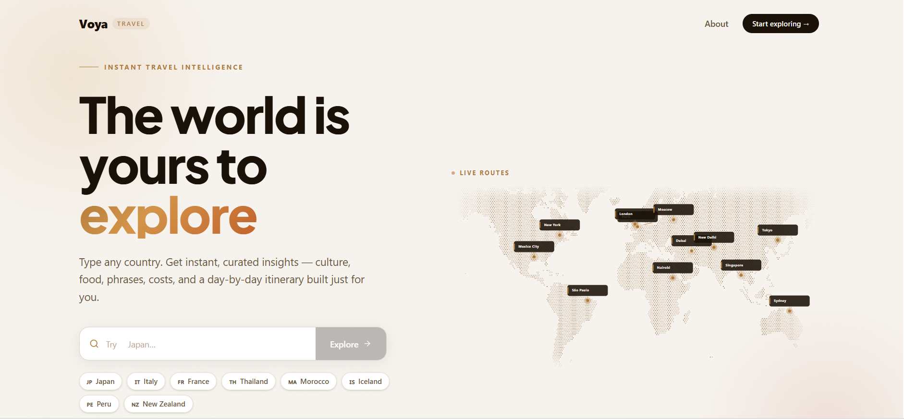

# Voya — Travel Planning Web App

> Type any country. Get instant travel insights — no account, no subscription, just go.

## About

Voya started as a question I kept asking myself: why is it still so hard to plan a trip well, without paying for a subscription?

Today's AI tools are powerful, but they fall short for real travel planning — usage limits mid-itinerary, generic routes, no guidance on local culture or practical costs. I felt that gap every time I tried to plan a trip, so I built Voya to fix it.

Voya is a free travel planning tool that delivers instant insights on any country in the world. Type a destination and get culture overviews, local food guides, essential phrases, budget breakdowns, day-by-day itineraries, safety tips, and packing lists — all in one place.

## Features

- 🌍 Search any of 195 countries instantly
- 🗺️ Interactive map with city explorer
- 🍜 Local food guides and must-try dishes
- 💬 Essential travel phrases with pronunciation
- 💰 Real budget breakdowns for every budget level
- 📅 Day-by-day itinerary builder
- 🛡️ Safety tips and travel warnings
- 🎒 Smart packing lists by destination

## Tech Stack

- React + TypeScript + Vite
- Tailwind CSS + Framer Motion
- Claude AI API
- Vercel (deployment)

## Live

[voya.travel](https://voya.travel)

## License

New original Voya code and documentation introduced after commit
[`2e33c74`](https://github.com/PremPaudel05/voya/commit/2e33c74d3c9b063d916bbae6096ac83a60f39e0b)
are **proprietary and require prior written permission from Prem Paudel to reuse**,
including for noncommercial projects. See [LICENSE](LICENSE) for the scope and exceptions.

Previously released MIT-licensed material remains available under its original
[MIT terms](LICENSES/MIT-legacy.txt). Third-party dependencies, data, and assets
retain their own licenses; calendar-data notices are preserved in
[the credits file](public/credits/date-holidays.txt).

Using the hosted Voya website is still permitted. For permission to reuse new
proprietary contributions, contact [Prem Paudel](mailto:leduopprem15@gmail.com).

© 2026 Prem Paudel.
